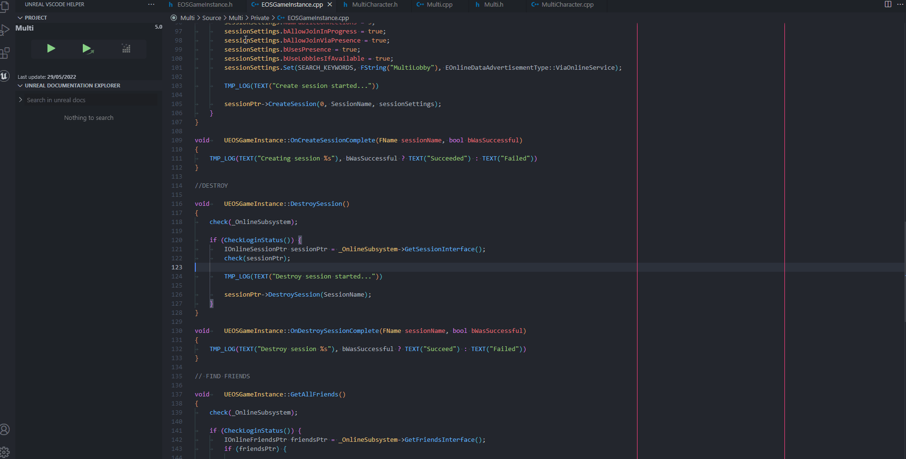
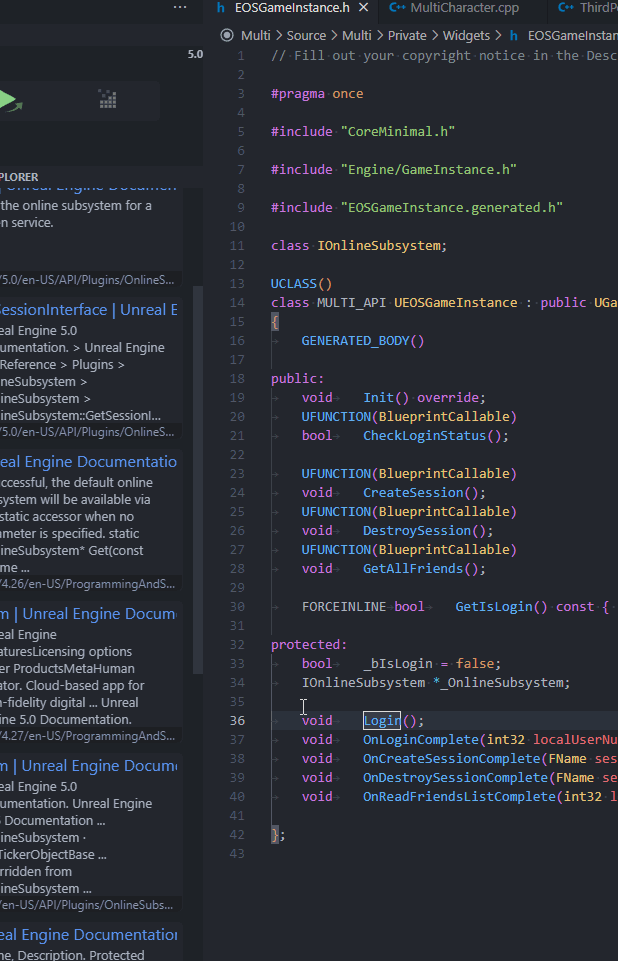
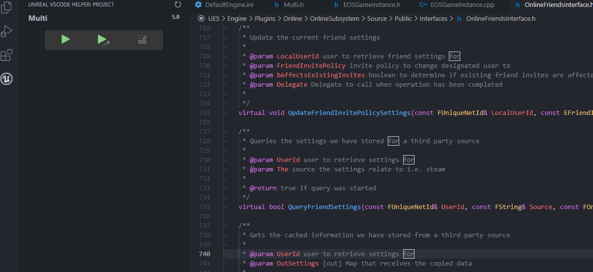
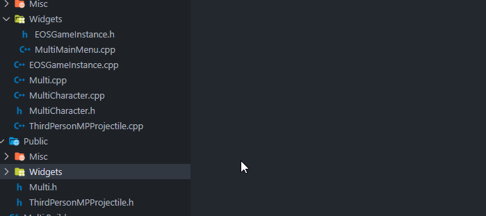

# UnrealVsCodeHelper README

#### This extension is here to help developing with UnrealEngine.  My ambitions is to give has much tools has VisualAssistX on VisualStudio (We're no even close yet :D)

> - **`Ideas`** coding@hugocabel.com
> - **`Issues`** https://github.com/hcabel/UnrealVsCodeHelper/issues
> - **`Help me`** https://github.com/hcabel/UnrealVsCodeHelper

# Features

### **`Unreal Documentation Explorer`**

 
 
This feature allow you to either go directly to a documentation page from selection.(using ctrl+f1 while selecting text) Or you can search it with the search bar(or ctrl+alt+f1) to see all the results INSIDE VsCode.

### **`ToolBar:`**
 
No need to mess with the launch/task.json with the ToolBar you can **easily launch your project.**
### **`SwitchFiles:`**
 
Allow you to find the header/cpp file corresponding to the file you'r curretly editing

# Extension Settings

###  **Comming soon...**

------------------------------------------------------------------------------------------------------------------------

## ***`Enjoy!`***
