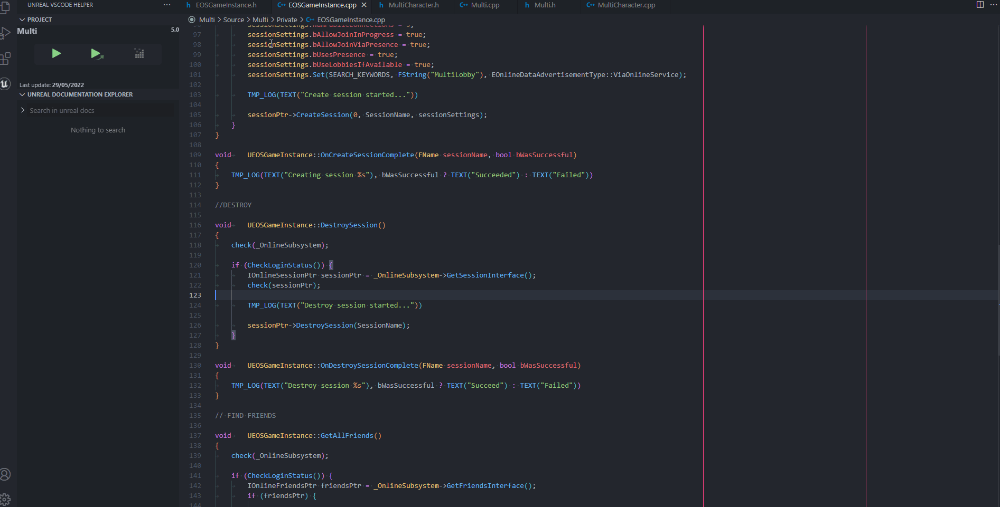
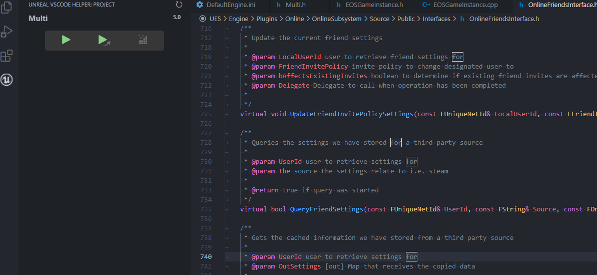
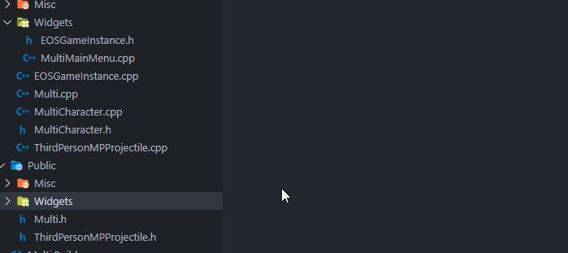

# UnrealVsCodeHelper

	<a style="display: flex; flex-direction: column; align-items: center; width: fit-content;"
		 href="https://youtu.be/_usDZ6osnR4">
		
		README video
	</a>

#### This extension is here to help you develop with Unreal Engine.

> - **`Ideas`** coding@hugocabel.com
> - **`Issues`** https://github.com/hcabel/UnrealVsCodeHelper/issues
> - **`Help me`** https://github.com/hcabel/UnrealVsCodeHelper

# Features

 

### **`UVCH Browser`**
 
This feature lets you jump directly to a documentation page from your selection (using `Ctrl+F1` while selecting text). You can also use the search bar (or `Ctrl+Alt+F1`) to see all the results.

### **`ToolBar`** 
 
No need to mess with your `launch.json`/`task.json` files — with the ToolBar you can **easily launch your project.**

### **`SwitchFiles`**
 
Lets you find the header/cpp file corresponding to the file you're currently editing.

# Extension Settings

### 1 - Global
- Disable any of the features

### 2 - ToolBar
- Add any launch parameters to Build/PlayEditor/PlayGame

------------------------------------------------------------------------------------------------------------------------

## ***`Enjoy!`***
